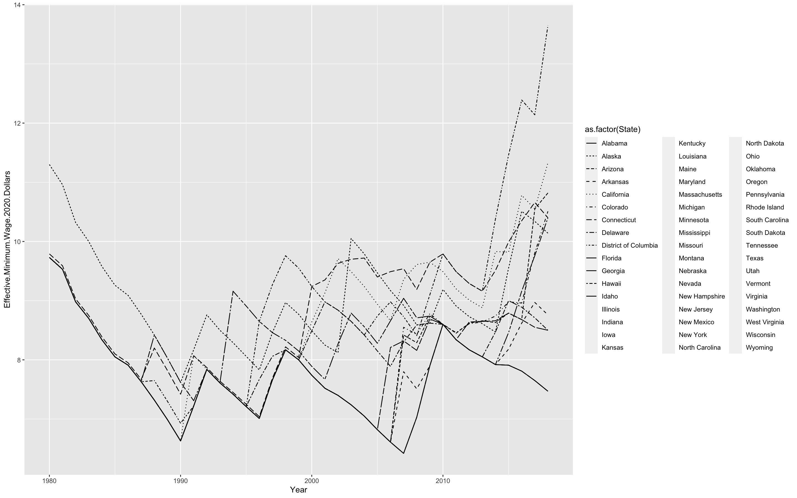

```{r setup, include=FALSE}
#install packages
library("haven")    
library("AER")   
library("fastDummies")
library("plm")
library("dynpanel")
library("clubSandwich")
library("ggplot2")
library("huxtable")
library("tidyverse") 
library("gridExtra")


df <- read.csv("table1.csv")
head(df)
df_poverty <- read.csv("data.csv") #data for 2008 poverty rate
#generate dummies
df$dummy8090 <- ifelse(df$Year < 1990, 1, 0)
df$dummy9000 <- ifelse(df$Year >= 1990 & df$Year < 2000, 1, 0)
df$dummy0010 <- ifelse(df$Year >= 2000 & df$Year < 2010, 1, 0)
df$dummy1018 <- ifelse(df$Year >= 2010 , 1, 0)

df <- dummy_cols(df, select_columns = "State")

# try to involve state dummies 
cols <- 9:59
nval <- 0:50
df$stateid <- t(sweep(df[, cols], 2, nval, "*"))[t(df[, cols]) != 0]
df$stateid

```

# Introduction

Minimum wage legislation is commonly believed to be job killers. As the reason for minimum wages can actually raise unemployment by giving employers less incentive to hire and more incentive to automate and outsource tasks that were previously performed by low-wage employees. However, recent studies and reality events also show that increasing the minimum wage, which does not necessarily reduce employment. For instance, adjusted for inflation, the federal minimum wage between 1967 and 1969 was one of the highest in history, while the unemployment rate during the same period was below 4 percent, relatively historically low.

We consulted some prior analyses of our question or of similar questions, like “Effects of the Minimum Wage on Employment Dynamics” by Jonathan Meer and Jeremy West and “Using Federal Minimum Wages to Identify the Impact of Minimum Wages on Employment and Earnings across the U.S. States” by Yusuf Soner Baskaya and Yona Rubinstein. These helped us formulate the hypothesis that unemployment and minimum wage are positively related. Both papers discuss and support this with evidence, which inspired us to perform similar analyses. We particularly want to break it down to a state level, where we find that this hypothesis holds true.

To further examine this interesting debate by using U.S state-level data as well as combine the methodology in econometrics, this project aims to analyze how changes in state minimum wages affect changes in the state unemployment level by making three models to explore this relationship. In the first basic model, we use the OLS model which regresses the state's unemployment rate on effective minimum wage in 2020 dollars. In the second model, based on the first basic model, we include year dummies by setting three time periods which are 1980-1989, 1990-1999, 2000-2009 to test the relationship between the change in the minimum wage and the change in the unemployment rate. In the third model, we build a panel regression model including state fixed effect and time fixed effect. Our hypothesis and results indicate that the change in state minimum wages has a positive relationship with the change in the state unemployment rate.

# Data

[link]:https://stackoverflow.com/questions/29787850/how-do-i-add-a-url-to-r-markdown

Our data has come from multiple sources. Our minimum wage data came from Kaggle [Kaggle]:https://www.kaggle.com/lislejoem/us-minimum-wage-by-state-from-1968-to-2017, who stripped it from the United States Department of Labor. This data broke down the minimum wage by the state every year from 1968 to 2020. The dataset contains the state minimum wage, federal minimum wage, and effective minimum wage. In this project, we choose the effective minimum wage in 2020 dollars as our dependent variable. The effective minimum wage is the higher of the state minimum wage and the federal minimum wage for each year. The second dataset is the average annual unemployment rates by the state which is collected by the U.S. Bureau of Labor Statistics. Before applying the regression into the data, we make data processing and cleaning beforehand. We compile two datasets into one table which contains the data from 1980 to 2018.


```{r, echo = T, warning= F}
ggplot(df, mapping = aes(x = Year, y = Effective.Minimum.Wage.2020.Dollars)) +
  geom_line(aes(linetype = as.factor(State)))
```


# Result
## Model 1: baseline model
```{r, echo = T, warning= F}
# model1:
fm0 <- lm(unemployment_rate ~ Effective.Minimum.Wage.2020.Dollars , data = df)
summary(fm0)
coeftest(fm0, df = Inf, vcov = vcovHC(fm0, type = "HC1"))
```

## Model2:
baseline model + year fixed effect + year $\cdot$ effective + state fixed effect + state $\cdot$ effective
```{r, echo = T, warning= F}

fm1 <- lm(unemployment_rate ~ Effective.Minimum.Wage.2020.Dollars+stateid + dummy8090 + dummy9000 + dummy0010 +Effective.Minimum.Wage.2020.Dollars*dummy8090+Effective.Minimum.Wage.2020.Dollars*dummy9000+Effective.Minimum.Wage.2020.Dollars*dummy0010, data = df)
summary(fm1)
coeftest(fm1, df = Inf, vcov = vcovHC(fm1, type = "HC1"))
```


## Model 3:
baseline model + year fixed effect (treat individual year instead of grouping the year into three) + state fixed effect
```{r, echo = T, warning= F}

fm2 <- plm(unemployment_rate ~ Effective.Minimum.Wage.2020.Dollars, 
    data = df,
    index = c("State", "Year"), 
    model = "within")
summary(fm2)
coeftest(fm2, df = Inf, vcov = vcovHC(fm2, type = "HC1"))
coeftest(fm2, df = Inf, vcov = vcovCR(fm2, type = "CR1"))
```
## Model 4:
```{r, echo = T, warning= F}
# model4:
df_model4 <- df %>% filter(Year == 2008, State != "District of Columbia")
fm4 <- lm(df_model4$unemployment_rate ~ df_model4$Effective.Minimum.Wage.2020.Dollars + df_poverty$Percent.Above.Poverty.Rate)
summary(fm4)
coeftest(fm4, df = Inf, vcov = vcovHC(fm4, type = "HC1"))
 ```


### Result Table

```{r, echo = T, warning= F}
huxreg(fm0,fm1, fm2,
       stars = c(`*` = 0.1, `**` = 0.05, `***` = 0.01),
       statistics = c("N" = "nobs", 
                      "R^2" = "r.squared"))%>%
  add_rows(rbind(c("Year FE", "no", "no","yes"), 
                 c("State FE", "no", "no","yes")), 
           copy_cell_props = FALSE,
           after = c(nrow(.) - 3))
 ```


{width =7,height = 5}
